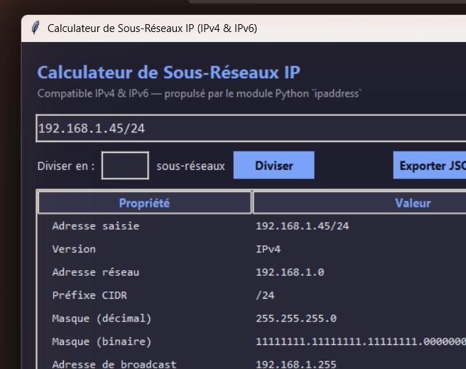

# 🌐 Calculateur de Sous-Réseaux IP (IPv4 & IPv6)

Un outil en ligne de commande (CLI) écrit en Python qui calcule et affiche
toutes les informations essentielles d'un réseau IP à partir d'une simple
adresse au format CIDR — que ce soit en **IPv4** ou en **IPv6**.

Projet réalisé dans le cadre de mon apprentissage des réseaux informatiques,
avec un code volontairement clair, commenté et pédagogique.


---

## ✨ Fonctionnalités

- 🔎 **Détection automatique** du type d'adresse (IPv4 / IPv6)
- 🖥️ **Interface en ligne de commande** interactive ou en argument direct
- 🪟 **Interface graphique** (Tkinter) pour une utilisation sans terminal
- 📊 **Tableaux colorés** grâce à la bibliothèque [`rich`](https://github.com/Textualize/rich)
- 🧮 Calcule automatiquement :
  - Adresse réseau
  - Adresse de broadcast (IPv4)
  - Masque de sous-réseau (décimal et binaire)
  - Première et dernière adresse IP utilisable
  - Nombre total d'hôtes disponibles
  - Type d'adresse : Privée / Publique / Loopback / Lien-local / Multicast...
- ⚠️ **Gestion des erreurs** avec messages clairs en cas de saisie invalide

---

## 📸 Aperçu

Interface graphique (Tkinter) affichant le résultat pour `192.168.1.45/24` :



---

## 🚀 Installation

1. **Cloner le dépôt**

```bash
git clone https://github.com/zahraabadreddine/IPproject.git
cd IPproject
```

2. **Créer un environnement virtuel (recommandé)**

```bash
python -m venv venv
source venv/bin/activate      # Sur Windows : venv\Scripts\activate
```

3. **Installer les dépendances**

```bash
pip install -r requirements.txt
```

---

## 🧑‍💻 Utilisation

### Mode interactif

```bash
python subnet_calculator.py
```

Le programme vous invite ensuite à saisir une adresse IP/CIDR :

```
➜ Adresse IP/CIDR : 10.0.0.1/8
```

Tapez `quit`, `exit` ou `q` pour quitter le programme.

### Mode argument direct

```bash
python subnet_calculator.py 192.168.1.45/24
python subnet_calculator.py 2001:db8::/32
```

### Mode graphique (GUI)

Une interface graphique (Tkinter, inclus nativement avec Python — aucune
dépendance supplémentaire) est aussi disponible pour une utilisation sans
terminal :

```bash
python subnet_calculator_gui.py
```

Saisissez une adresse IP/CIDR dans le champ puis cliquez sur **Calculer**
(ou appuyez sur Entrée) pour afficher les résultats dans le tableau.

### Découpage en sous-réseaux (subnetting)

Diviser un réseau en N sous-réseaux égaux :

```bash
python subnet_calculator.py 192.168.1.0/24 --split 4
```

Ou diviser en précisant directement le nouveau préfixe CIDR :

```bash
python subnet_calculator.py 192.168.1.0/24 --new-prefix 26
```

### Export des résultats (CSV / JSON)

Chaque mode (adresse unique ou découpage) peut être exporté :

```bash
python subnet_calculator.py 192.168.1.45/24 --export-csv resultats.csv
python subnet_calculator.py 192.168.1.0/24 --split 4 --export-json resultats.json
```

### Traitement par lot (batch)

Analyser une liste d'adresses IP/CIDR depuis un fichier texte (une adresse
par ligne), avec export optionnel :

```bash
python subnet_calculator.py --batch adresses.txt
python subnet_calculator.py --batch adresses.txt --export-csv resultats.csv
```

---

## ✅ Tests

Les fonctions de calcul (partagées entre la CLI et la GUI) sont couvertes par
une suite de tests unitaires [`pytest`](https://docs.pytest.org/).

```bash
pip install -r requirements-dev.txt
pytest
```

---

## 🧠 Exemples

| Entrée                     | Sortie principale                                      |
|-----------------------------|---------------------------------------------------------|
| `192.168.1.45/24`           | Réseau `192.168.1.0/24`, 254 hôtes, type Privée          |
| `8.8.8.8/32`                 | Hôte unique, type Publique                               |
| `127.0.0.1/8`                | Type Loopback                                             |
| `2001:db8::/32`              | Réseau IPv6, type Privée (plage réservée à la documentation) |

---

## 🛠️ Stack technique

- **Python 3.10+**
- [`ipaddress`](https://docs.python.org/3/library/ipaddress.html) — module natif pour toute la logique de calcul réseau
- [`rich`](https://github.com/Textualize/rich) — affichage coloré et tableaux dans le terminal

---

## 📁 Structure du projet

```
IPproject/
├── .github/
│   └── workflows/
│       └── tests.yml           # Intégration continue (GitHub Actions)
├── subnet_calculator.py        # Script principal (CLI)
├── subnet_calculator_gui.py    # Interface graphique (Tkinter)
├── screenshots/
│   └── gui.png                 # Capture d'écran de l'interface graphique
├── tests/
│   └── test_subnet_calculator.py  # Suite de tests unitaires (pytest)
├── requirements.txt            # Dépendances de production
├── requirements-dev.txt        # Dépendances de développement (+ pytest)
├── LICENSE                     # Licence MIT
└── README.md                   # Ce fichier
```

---

## 🤝 Contribuer

Les suggestions et contributions sont les bienvenues ! N'hésitez pas à ouvrir
une *issue* ou une *pull request*.

---

## 📄 Licence

Ce projet est distribué sous licence MIT — libre d'utilisation, de
modification et de distribution.

---

## 👩‍💻 Auteur

Développé par **Zahraa Badreddine**, étudiante en informatique passionnée par les
réseaux et la cybersécurité.

- GitHub : [@zahraabadreddine](https://github.com/zahraabadreddine)
- LinkedIn : [Zahraa Badreddine](https://www.linkedin.com/in/zahraa-badreddine)


